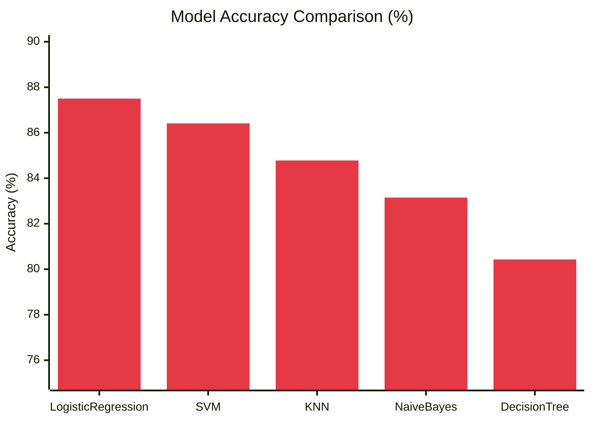
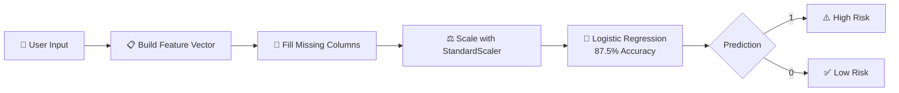

# ❤️ Heart Stroke Prediction App

<div align="center">


[](https://streamlit.io)
[](https://www.python.org)
[](https://scikit-learn.org)
[](#-model-performance)
[](LICENSE)


</div>

---

## 🩺 About The Project


An interactive **Streamlit web app** that predicts the risk of heart disease based on a patient's medical attributes — age, chest pain type, cholesterol, resting ECG, and more.

Five classification models were trained and benchmarked on the dataset. **Logistic Regression** came out on top and was selected as the production model, delivering instant, easy-to-understand risk predictions right in your browser.

- 🎯 Real-time predictions
- 🏆 Best-performing model selected after benchmarking 5 algorithms
- 📊 Trained on the UCI Heart Failure dataset
- ⚡ Lightweight and fast
- 🖥️ Clean, slider-based UI

<br clear="right"/>

---

## ✨ Demo

<div align="center">

</div>

---

## 🚀 Quick Start

```bash
# Clone the repository
git clone https://github.com/subhajit404/ML-Heart-Disease.git
cd heart-stroke-prediction

# Install dependencies
pip install -r requirements.txt

# Run the app
streamlit run app.py
```

The app will open automatically at `http://localhost:8501` 🎉

---

## 🏆 Model Performance

Five models were trained and evaluated. **Logistic Regression** achieved the highest accuracy and F1 score, and was selected as the final model powering this app.

<div align="center">

| Rank | Model | Accuracy | F1 Score | Status |
|:---:|---|:---:|:---:|:---:|
| 🥇 | **Logistic Regression** | **87.50%** | **0.8900** | ✅ **Selected** |
| 🥈 | SVM | 86.41% | 0.8804 | — |
| 🥉 | KNN | 84.78% | 0.8654 | — |
| 4 | Naive Bayes | 83.15% | 0.8458 | — |
| 5 | Decision Tree | 80.43% | 0.8182 | — |

</div>

### 📈 Accuracy Comparison



> ✅ **Logistic Regression selected** — highest accuracy (**87.50%**) and highest F1 score (**0.89**) among all tested models.

---

## 🧠 How It Works

<div align="center">



</div>

---

## 📥 Input Parameters

| Feature | Description | Type |
|---|---|---|
| `Age` | Patient's age | Slider (18–100) |
| `Sex` | M / F | Dropdown |
| `ChestPainType` | ATA, NAP, TA, ASY | Dropdown |
| `RestingBP` | Resting blood pressure (mm Hg) | Number (80–200) |
| `Cholesterol` | Serum cholesterol (mg/dL) | Number (100–600) |
| `FastingBS` | Fasting blood sugar > 120 mg/dL | 0 / 1 |
| `RestingECG` | Normal, ST, LVH | Dropdown |
| `MaxHR` | Maximum heart rate achieved | Slider (60–220) |
| `ExerciseAngina` | Exercise-induced angina (Y/N) | Dropdown |
| `Oldpeak` | ST depression induced by exercise | Slider (0.0–6.0) |
| `ST_Slope` | Up, Flat, Down | Dropdown |

---

## 🛠️ Tech Stack

<div align="center">


</div>

---

## 📁 Project Structure

```
heart-stroke-prediction/
├── app.py                   # Streamlit application
├── main.ipynb                # Model training & benchmarking notebook
├── LogisticRegression.pkl    # Trained model (best performer — 87.5% accuracy)
├── scaler.pkl                 # Fitted StandardScaler
├── columns.pkl                # Expected feature columns
├── heart.csv                  # Training dataset
├── requirements.txt           # Dependencies
└── README.md
```

---

## ⚠️ Disclaimer


Try this Tool Now and give me suggestion to improve this model

<br clear="left"/>

---

<div align="center">

### 💖 Show some love by starring this repo!


</div>
